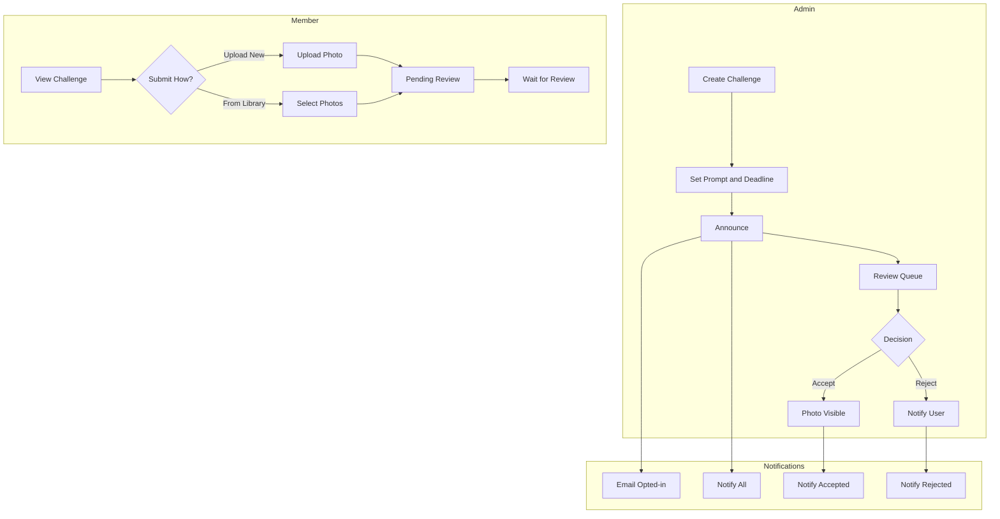

# Photo Challenges Implementation Plan

## Overview

Standalone photo challenges - a separate entity from albums. Admins create challenges with themed prompts, any member can submit photos (upload new or from library), and all submissions require admin approval before appearing publicly in the challenge gallery.

## Database Schema

### New Table: `challenges`

```sql
CREATE TABLE challenges (
  id UUID PRIMARY KEY DEFAULT gen_random_uuid(),
  slug TEXT NOT NULL UNIQUE,
  title TEXT NOT NULL,
  prompt TEXT NOT NULL,                    -- Theme/description
  cover_image_url TEXT,                    -- Optional cover image
  image_blurhash TEXT,                     -- Blurhash for instant placeholder
  image_width INTEGER,                     -- Cover image dimensions
  image_height INTEGER,
  starts_at TIMESTAMPTZ DEFAULT now(),     -- When submissions open
  ends_at TIMESTAMPTZ,                     -- Submission deadline (null = no deadline)
  announced_at TIMESTAMPTZ,                -- When challenge was announced
  created_by UUID NOT NULL REFERENCES profiles(id),
  is_active BOOLEAN DEFAULT true,          -- Admin can deactivate
  created_at TIMESTAMPTZ DEFAULT now(),
  updated_at TIMESTAMPTZ DEFAULT now()
);

CREATE INDEX idx_challenges_active ON challenges(is_active, starts_at);
CREATE INDEX idx_challenges_slug ON challenges(slug);
```

### New Table: `challenge_submissions`

Tracks all submissions (pending, accepted, rejected):

```sql
CREATE TABLE challenge_submissions (
  id UUID PRIMARY KEY DEFAULT gen_random_uuid(),
  challenge_id UUID NOT NULL REFERENCES challenges(id) ON DELETE CASCADE,
  photo_id UUID NOT NULL REFERENCES photos(id) ON DELETE CASCADE,
  user_id UUID NOT NULL REFERENCES profiles(id) ON DELETE CASCADE,
  status TEXT NOT NULL DEFAULT 'pending' CHECK (status IN ('pending', 'accepted', 'rejected')),
  submitted_at TIMESTAMPTZ DEFAULT now(),
  reviewed_at TIMESTAMPTZ,
  reviewed_by UUID REFERENCES profiles(id),
  rejection_reason TEXT,
  UNIQUE(challenge_id, photo_id)
);

CREATE INDEX idx_challenge_submissions_challenge_status ON challenge_submissions(challenge_id, status);
CREATE INDEX idx_challenge_submissions_user ON challenge_submissions(user_id);
```

### New Table: `challenge_announcements`

Track announcement history (pattern from `event_announcements`):

```sql
CREATE TABLE challenge_announcements (
  id SERIAL PRIMARY KEY,
  challenge_id UUID NOT NULL REFERENCES challenges(id) ON DELETE CASCADE,
  announced_by UUID NOT NULL REFERENCES profiles(id),
  recipient_count INTEGER NOT NULL DEFAULT 0,
  created_at TIMESTAMPTZ DEFAULT now()
);

CREATE INDEX idx_challenge_announcements_challenge ON challenge_announcements(challenge_id);
```

### View: `challenge_photos`

Convenience view for accepted photos only:

```sql
CREATE VIEW challenge_photos AS
SELECT 
  cs.challenge_id,
  cs.photo_id,
  cs.user_id,
  cs.submitted_at,
  cs.reviewed_at,
  p.url,
  p.width,
  p.height,
  p.title,
  p.blurhash
FROM challenge_submissions cs
JOIN photos p ON p.id = cs.photo_id
WHERE cs.status = 'accepted'
  AND p.deleted_at IS NULL;
```

### Email Type

```sql
INSERT INTO email_types (slug, name, description, default_enabled)
VALUES ('photo_challenges', 'Photo Challenges', 'Notifications about new photo challenges', true);
```

### RLS Policies

```sql
-- challenges: Public read, admin write
CREATE POLICY "Anyone can view active challenges"
  ON challenges FOR SELECT
  USING (is_active = true OR is_admin());

CREATE POLICY "Admins can manage challenges"
  ON challenges FOR ALL
  USING (is_admin());

-- challenge_submissions: User sees own, admin sees all
CREATE POLICY "Users can view own submissions"
  ON challenge_submissions FOR SELECT
  USING (user_id = auth.uid() OR is_admin());

CREATE POLICY "Users can submit to active challenges"
  ON challenge_submissions FOR INSERT
  WITH CHECK (
    auth.uid() = user_id AND
    EXISTS (
      SELECT 1 FROM challenges 
      WHERE id = challenge_id 
        AND is_active = true
        AND (ends_at IS NULL OR ends_at > now())
    )
  );

CREATE POLICY "Users can withdraw pending submissions"
  ON challenge_submissions FOR DELETE
  USING ((user_id = auth.uid() AND status = 'pending') OR is_admin());

CREATE POLICY "Admins can review submissions"
  ON challenge_submissions FOR UPDATE
  USING (is_admin());
```

### RPC: `submit_to_challenge`

```sql
CREATE OR REPLACE FUNCTION submit_to_challenge(
  p_challenge_id UUID,
  p_photo_ids UUID[]
) RETURNS INTEGER AS $$
DECLARE
  v_user_id UUID := auth.uid();
  v_inserted INTEGER := 0;
BEGIN
  -- Verify challenge is active and accepting submissions
  IF NOT EXISTS (
    SELECT 1 FROM challenges 
    WHERE id = p_challenge_id 
      AND is_active = true
      AND (ends_at IS NULL OR ends_at > now())
  ) THEN
    RAISE EXCEPTION 'Challenge is not accepting submissions';
  END IF;

  -- Insert submissions (only user's own photos, skip duplicates)
  INSERT INTO challenge_submissions (challenge_id, photo_id, user_id)
  SELECT p_challenge_id, photo_id, v_user_id
  FROM unnest(p_photo_ids) AS photo_id
  WHERE EXISTS (SELECT 1 FROM photos WHERE id = photo_id AND user_id = v_user_id)
  ON CONFLICT (challenge_id, photo_id) DO NOTHING;

  GET DIAGNOSTICS v_inserted = ROW_COUNT;
  RETURN v_inserted;
END;
$$ LANGUAGE plpgsql SECURITY DEFINER;
```

### RPC: `review_challenge_submission`

```sql
CREATE OR REPLACE FUNCTION review_challenge_submission(
  p_submission_id UUID,
  p_status TEXT,
  p_rejection_reason TEXT DEFAULT NULL
) RETURNS VOID AS $$
BEGIN
  IF NOT is_admin() THEN
    RAISE EXCEPTION 'Only admins can review submissions';
  END IF;

  UPDATE challenge_submissions
  SET status = p_status,
      reviewed_at = now(),
      reviewed_by = auth.uid(),
      rejection_reason = CASE WHEN p_status = 'rejected' THEN p_rejection_reason ELSE NULL END
  WHERE id = p_submission_id;
END;
$$ LANGUAGE plpgsql SECURITY DEFINER;
```

## Data Flow




## UI Components

### 1. Challenges Listing Page

**File:** `src/app/challenges/page.tsx`

- Active challenges section (accepting submissions)
- Past challenges section (ended/view-only)
- Challenge cards with: title, prompt preview, deadline, accepted photo count

### 2. Challenge Detail Page

**File:** `src/app/challenges/[slug]/page.tsx`

Custom layout (NOT using AlbumContent):

- Challenge header: title, full prompt, deadline countdown
- "Submit Photos" button (authenticated users only)
- Gallery of accepted photos (custom grid, not album view)
- Contributors shown via StackedAvatarsPopover

### 3. Submit to Challenge Flow

#### Opening the Modal (from Challenge Detail Page)

Pattern from [AlbumDetailClient.tsx](src/app/account/(manage)/albums/[slug]/AlbumDetailClient.tsx):

```typescript
const handleSubmitToChallenge = () => {
  if (!challenge) return;

  modalContext.setSize('large');
  modalContext.setTitle(`Submit to: ${challenge.title}`);
  modalContext.setContent(
    <SubmitToChallengeContent
      challengeId={challenge.id}
      existingSubmissionPhotoIds={mySubmissions.map((s) => s.photo_id)}
      onClose={() => modalContext.setIsOpen(false)}
      onSuccess={async () => {
        queryClient.invalidateQueries({ queryKey: ['challenge-submissions', challenge.id] });
        queryClient.invalidateQueries({ queryKey: ['my-submissions', user?.id] });
        modalContext.setIsOpen(false);
      }}
    />
  );
  modalContext.setIsOpen(true);
};
```

#### Submit Content Component

**File:** `src/components/challenges/SubmitToChallengeContent.tsx`

Pattern from [AddToAlbumContent.tsx](src/components/manage/AddToAlbumContent.tsx):

```typescript
interface SubmitToChallengeContentProps {
  challengeId: string;
  existingSubmissionPhotoIds: string[];  // Photos already submitted
  onClose: () => void;
  onSuccess: () => void;
}

export default function SubmitToChallengeContent({
  challengeId,
  existingSubmissionPhotoIds,
  onClose,
  onSuccess,
}: SubmitToChallengeContentProps) {
  const { user } = useAuth();
  const supabase = useSupabase();
  const modalContext = useContext(ModalContext);
  const [photos, setPhotos] = useState<Photo[]>([]);
  const [selectedPhotoIds, setSelectedPhotoIds] = useState<Set<string>>(new Set());
  const [isLoading, setIsLoading] = useState(true);
  const [isSubmitting, setIsSubmitting] = useState(false);
  const [error, setError] = useState<string | null>(null);
  const [activeTab, setActiveTab] = useState<'library' | 'upload'>('library');

  // Fetch user's photos
  useEffect(() => {
    if (!user) return;
    const fetchPhotos = async () => {
      setIsLoading(true);
      const { data } = await supabase
        .from('photos')
        .select('*')
        .eq('user_id', user.id)
        .is('deleted_at', null)
        .order('created_at', { ascending: false })
        .limit(100);
      setPhotos((data || []) as Photo[]);
      setIsLoading(false);
    };
    fetchPhotos();
  }, [user, supabase]);

  // Filter out photos already submitted to this challenge
  const availablePhotos = useMemo(
    () => photos.filter((p) => !existingSubmissionPhotoIds.includes(p.id)),
    [photos, existingSubmissionPhotoIds]
  );

  // Selection handlers (same pattern as AddToAlbumContent)
  const handleSelectPhoto = (photoId: string, isMultiSelect: boolean) => {
    setSelectedPhotoIds((prev) => {
      const newSet = new Set(prev);
      if (newSet.has(photoId)) {
        newSet.delete(photoId);
      } else {
        newSet.add(photoId);
      }
      return newSet;
    });
  };

  // Submit via RPC
  const handleSubmit = async () => {
    if (selectedPhotoIds.size === 0) return;
    setIsSubmitting(true);
    setError(null);

    try {
      const { error: rpcError } = await supabase.rpc('submit_to_challenge', {
        p_challenge_id: challengeId,
        p_photo_ids: Array.from(selectedPhotoIds),
      });

      if (rpcError) throw new Error(rpcError.message);
      onSuccess();
    } catch (err) {
      setError(err instanceof Error ? err.message : 'Failed to submit');
    } finally {
      setIsSubmitting(false);
    }
  };

  // Sticky footer with action buttons
  useEffect(() => {
    modalContext.setFooter(
      <div className="flex justify-end gap-2">
        <Button variant="secondary" onClick={onClose} disabled={isSubmitting}>
          Cancel
        </Button>
        <Button
          onClick={handleSubmit}
          disabled={isSubmitting || selectedPhotoIds.size === 0}
          loading={isSubmitting}
        >
          Submit {selectedPhotoIds.size > 0 ? `${selectedPhotoIds.size} ` : ''}
          photo{selectedPhotoIds.size !== 1 ? 's' : ''}
        </Button>
      </div>
    );
  }, [selectedPhotoIds.size, isSubmitting]);

  return (
    <div className="flex h-[60vh] flex-col">
      {/* Tab switcher: Library | Upload */}
      <div className="flex gap-2 mb-4">
        <Button 
          variant={activeTab === 'library' ? 'primary' : 'secondary'}
          onClick={() => setActiveTab('library')}
        >
          From Library
        </Button>
        <Button 
          variant={activeTab === 'upload' ? 'primary' : 'secondary'}
          onClick={() => setActiveTab('upload')}
        >
          Upload New
        </Button>
      </div>

      {activeTab === 'library' ? (
        <div className="flex-1 min-h-0 overflow-y-auto">
          {isLoading ? (
            <p>Loading photos...</p>
          ) : availablePhotos.length === 0 ? (
            <p>No photos available to submit</p>
          ) : (
            <PhotoGrid
              photos={availablePhotos}
              selectedPhotoIds={selectedPhotoIds}
              onSelectPhoto={handleSelectPhoto}
              onPhotoClick={(photo) => handleSelectPhoto(photo.id, true)}
              sortable={false}
            />
          )}
        </div>
      ) : (
        <DropZone onFilesSelected={handleUploadAndSubmit} />
      )}

      {error && <ErrorMessage>{error}</ErrorMessage>}
    </div>
  );
}
```

Key patterns from existing code:

- **Modal opening**: Use `modalContext.setSize()`, `setTitle()`, `setContent()`, `setIsOpen()`
- **Sticky footer**: Use `modalContext.setFooter()` in useEffect
- **Photo grid**: Reuse existing `PhotoGrid` component with selection state
- **Selection tracking**: `useState<Set<string>>` for `selectedPhotoIds`
- **Filtering**: `useMemo` to filter out already-submitted photos
- **RPC submission**: Call `submit_to_challenge` with array of photo IDs
- **Query invalidation**: Invalidate relevant queries in `onSuccess`

Both paths (library and upload) create pending submissions requiring admin approval.

### 4. My Submissions

**Location:** `src/app/account/challenges/page.tsx` or in activity feed

- List of user's submissions across all challenges
- Status: Pending (yellow), Accepted (green), Rejected (red)
- Can withdraw pending submissions
- View rejection reason if rejected

### 5. Admin: Challenge Management

#### List Page

**File:** `src/app/admin/challenges/page.tsx`

- List all challenges (active/inactive)
- Link to create: `/admin/challenges/new`
- Link to edit: `/admin/challenges/[slug]`
- View submission counts per challenge

#### Create/Edit Page (Combined)

**File:** `src/app/admin/challenges/[slug]/page.tsx`

Pattern from [admin/events/[eventId]/page.tsx](src/app/admin/events/[eventId]/page.tsx):

```typescript
const slug = params.slug as string;
const isNewChallenge = slug === 'new';

// Auto-generate slug from title on blur
const generateSlug = (text: string) => {
  return text
    .toLowerCase()
    .replace(/[^a-z0-9\s-]/g, '')
    .replace(/\s+/g, '-')
    .replace(/-+/g, '-')
    .replace(/^-|-$/g, '');
};

const handleTitleBlur = () => {
  if (!slug.trim() && title.trim()) {
    setSlug(generateSlug(title));
  }
};

// Track unsaved changes
useFormChanges(currentFormValues, savedFormValues, {}, !!coverImageFile);
```

Key features:

- `isNewChallenge = slug === 'new'` for create vs edit in one page
- `ChallengeForm` component with: title, slug, prompt, start/end dates, cover image
- Auto-generate slug from title on blur
- `useFormChanges` hook for unsaved changes warning
- Cover image upload with blurhash generation (pattern from `EventCoverUpload`)
- Notifications section with Announce button (opens modal)
- Danger zone for delete (existing challenges only)

#### Announce Challenge Modal

**File:** `src/components/admin/AnnounceChallengeModal.tsx`

Pattern from [AnnounceEventModal.tsx](src/components/admin/AnnounceEventModal.tsx):

```typescript
// Reuse existing RecipientList component
import RecipientList from '@/components/admin/RecipientList';

// Fetch subscribers respecting photo_challenges email preference
const loadSubscribers = async () => {
  const { data: allProfiles } = await supabase
    .from('profiles')
    .select('id, email, full_name, nickname, created_at')
    .is('suspended_at', null)
    .not('email', 'is', null);

  const { data: challengesEmailType } = await supabase
    .from('email_types')
    .select('id')
    .eq('type_key', 'photo_challenges')
    .single();

  const { data: optedOutUsers } = await supabase
    .from('email_preferences')
    .select('user_id')
    .eq('email_type_id', challengesEmailType.id)
    .eq('opted_out', true);

  // Filter and map to RecipientList format
  const subscribersList = allProfiles
    .filter(profile => !optedOutUserIds.has(profile.id))
    .map(profile => ({
      email: profile.email!,
      name: profile.full_name || profile.email!.split('@')[0],
      nickname: profile.nickname,
      selected: true,
    }));
};

// Modal footer with sticky buttons
useEffect(() => {
  modalContext.setFooter(
    <div className="flex justify-end gap-3">
      <Button variant="secondary" onClick={onClose} disabled={isSending}>
        Cancel
      </Button>
      <Button
        variant="primary"
        onClick={handleSend}
        disabled={isSending || selectedCount === 0}
        loading={isSending}
      >
        Send announcement
      </Button>
    </div>
  );
}, [isSending, selectedCount]);
```

### 6. Admin: Review Queue

**File:** `src/app/admin/challenges/[slug]/submissions/page.tsx`

- Tabs: Pending | Accepted | Rejected
- Pending submissions grid with:
  - Photo thumbnail
  - Submitter info (avatar, name)
  - Submission date
  - Accept / Reject buttons
- Bulk accept/reject actions
- Optional rejection reason modal

## API Routes

### Announce Challenge

**File:** `src/app/api/admin/challenges/announce/route.ts`

Pattern from [admin/events/announce/route.ts](src/app/api/admin/events/announce/route.ts):

```typescript
// Key implementation details:

// 1. Verify admin access
const { data: profile } = await supabase
  .from('profiles')
  .select('is_admin')
  .eq('id', user.id)
  .single();

if (!profile?.is_admin) {
  return NextResponse.json({ message: 'Admin access required' }, { status: 403 });
}

// 2. Batch email sending (100 per batch, 500ms delay)
const batchSize = 100;
for (let i = 0; i < subscribers.length; i += batchSize) {
  const batch = subscribers.slice(i, i + batchSize);
  const batchEmails = await Promise.all(batch.map(async (subscriber) => ({
    from: `${process.env.EMAIL_FROM_NAME} <${process.env.EMAIL_FROM_ADDRESS}>`,
    to: subscriber.email,
    subject: `New Photo Challenge: ${challenge.title}`,
    html: await render(ChallengeAnnouncementEmail({ ... })),
  })));

  const batchResult = await resend.batch.send(batchEmails);
  // Track per-recipient status...

  if (i + batchSize < subscribers.length) {
    await new Promise(resolve => setTimeout(resolve, 500));
  }
}

// 3. Create in-app notifications
const notificationPromises = successfulSubscribers.map(subscriber =>
  createNotification({
    userId: subscriber.id,
    actorId: user.id,
    type: 'challenge_announced',
    entityType: 'challenge',
    entityId: challenge.id,
    data: {
      title: challenge.title,
      thumbnail: challenge.cover_image_url,
      link: `/challenges/${challenge.slug}`,
    },
  })
);
await Promise.all(notificationPromises);

// 4. Record announcement and update challenge
await supabase.from('challenge_announcements').insert({
  challenge_id: challengeId,
  announced_by: user.id,
  recipient_count: successCount,
});

await supabase
  .from('challenges')
  .update({ announced_at: new Date().toISOString() })
  .eq('id', challengeId);

// 5. Return detailed status
return NextResponse.json({
  success: true,
  sent: successCount,
  failed: errorCount,
  total: subscribers.length,
  sendStatus,      // Per-recipient: 'success' | 'error'
  errorDetails,    // Per-recipient error messages
});
```

## Notifications

Add to `src/types/notifications.ts`:

```typescript
type: 'challenge_announced'     // New challenge available
type: 'submission_accepted'     // Your photo was accepted  
type: 'submission_rejected'     // Your photo was rejected
```

## Email Template

**File:** `src/emails/ChallengeAnnouncement.tsx`

Pattern after existing email templates:

- Challenge title
- Prompt/theme description
- Deadline (if set)
- CTA: "View Challenge" button
- Unsubscribe link

## Key Files


| File                                                     | Type | Description                           |
| -------------------------------------------------------- | ---- | ------------------------------------- |
| `supabase/migrations/XXXXXXXX_challenges.sql`            | New  | Tables, views, RLS, RPCs              |
| `src/types/challenges.ts`                                | New  | Challenge, ChallengeSubmission types  |
| `src/lib/data/challenges.ts`                             | New  | Server-side data fetching             |
| `src/hooks/useChallenges.ts`                             | New  | List challenges                       |
| `src/hooks/useChallengeSubmissions.ts`                   | New  | Submit, list, withdraw                |
| `src/app/challenges/page.tsx`                            | New  | Challenges listing                    |
| `src/app/challenges/[slug]/page.tsx`                     | New  | Challenge detail + gallery            |
| `src/components/challenges/ChallengeCard.tsx`            | New  | Card component                        |
| `src/components/challenges/SubmitToChallengeContent.tsx` | New  | Upload/library submission             |
| `src/components/challenges/ChallengeGallery.tsx`         | New  | Custom photo grid for accepted photos |
| `src/app/account/challenges/page.tsx`                    | New  | User's submissions                    |
| `src/app/admin/challenges/page.tsx`                      | New  | Admin list                            |
| `src/app/admin/challenges/[slug]/page.tsx`               | New  | Admin create/edit                     |
| `src/app/admin/challenges/[slug]/submissions/page.tsx`   | New  | Review queue                          |
| `src/components/admin/AnnounceChallengeModal.tsx`        | New  | Announce modal                        |
| `src/app/api/admin/challenges/announce/route.ts`         | New  | Announce API                          |
| `src/emails/ChallengeAnnouncement.tsx`                   | New  | Email template                        |


## Components to Reuse


| Component                  | Location                                    | Usage                                   |
| -------------------------- | ------------------------------------------- | --------------------------------------- |
| `RecipientList`            | `src/components/admin/RecipientList.tsx`    | Announce modal recipient selection      |
| `PhotoGrid`                | `src/components/manage/PhotoGrid.tsx`       | Library photo selection in submit modal |
| `EventCoverUpload` pattern | `src/components/admin/EventCoverUpload.tsx` | Cover image upload with validation      |
| `useFormChanges`           | `src/hooks/useFormChanges.ts`               | Unsaved changes warning                 |
| `createNotification`       | `src/lib/notifications/create.ts`           | In-app notifications                    |
| `encrypt`                  | `src/utils/encrypt.ts`                      | Email unsubscribe tokens                |
| `ModalContext`             | `src/app/providers/ModalProvider.tsx`       | Modal management with sticky footer     |
| `DropZone`                 | `src/components/shared/DropZone.tsx`        | Upload new photos tab                   |


## Implementation Phases

**Phase 1: Database**

- Migration with tables, view, policies, RPCs
- Email type entry
- Generate TypeScript types

**Phase 2: Types & Data Layer**

- Challenge types
- Server-side data fetching functions
- React Query hooks

**Phase 3: Public Pages**

- Challenges listing page
- Challenge detail page with gallery
- Custom gallery component (not AlbumContent)

**Phase 4: Submission Flow**

- Submit modal with upload + library tabs
- Integration with existing photo upload hook
- My submissions page

**Phase 5: Admin**

- Challenge CRUD
- Announce functionality
- Review queue with accept/reject

**Phase 6: Notifications**

- Email template
- Announce API with email + notifications
- Submission result notifications

## Considerations

- **Photo ownership**: Submitted photos belong to the user. Acceptance just makes them visible in challenge.
- **Upload flow**: When uploading directly, photo is added to user's library AND submitted to challenge in one flow.
- **Withdrawal**: Users can only withdraw pending submissions. Accepted photos stay visible.
- **Deadline enforcement**: Database RPC checks `ends_at` before allowing submissions.
- **No album connection**: Challenges are completely separate from the albums system.
- **Custom gallery**: Challenge photos use a dedicated component, not the album viewer.
- **Blurhash**: Cover images generate blurhash for instant placeholders (like events).
- **Batch emails**: Announce sends up to 100 emails per batch with 500ms delays to respect rate limits.
- **Combined create/edit**: Use `slug === 'new'` pattern for single admin page handling both cases.
- **Modal footer**: Use `modalContext.setFooter()` for sticky action buttons in modals.

