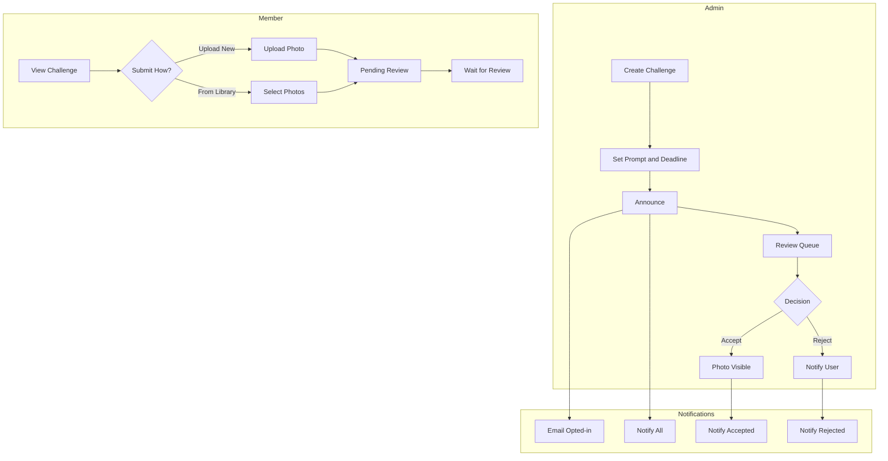

# Photo Challenges Implementation Plan

## Overview

Standalone photo challenges - a separate entity from albums. Admins create challenges with themed prompts, any member can submit photos (upload new or from library), and all submissions require admin approval before appearing publicly in the challenge gallery.

## Database Schema

### New Table: `challenges`

```sql
CREATE TABLE challenges (
  id UUID PRIMARY KEY DEFAULT gen_random_uuid(),
  slug TEXT NOT NULL UNIQUE,
  title TEXT NOT NULL,
  prompt TEXT NOT NULL,                    -- Theme/description
  cover_image_url TEXT,                    -- Optional cover image
  starts_at TIMESTAMPTZ DEFAULT now(),     -- When submissions open
  ends_at TIMESTAMPTZ,                     -- Submission deadline (null = no deadline)
  announced_at TIMESTAMPTZ,                -- When challenge was announced
  created_by UUID NOT NULL REFERENCES profiles(id),
  is_active BOOLEAN DEFAULT true,          -- Admin can deactivate
  created_at TIMESTAMPTZ DEFAULT now(),
  updated_at TIMESTAMPTZ DEFAULT now()
);

CREATE INDEX idx_challenges_active ON challenges(is_active, starts_at);
CREATE INDEX idx_challenges_slug ON challenges(slug);
```

### New Table: `challenge_submissions`

Tracks all submissions (pending, accepted, rejected):

```sql
CREATE TABLE challenge_submissions (
  id UUID PRIMARY KEY DEFAULT gen_random_uuid(),
  challenge_id UUID NOT NULL REFERENCES challenges(id) ON DELETE CASCADE,
  photo_id UUID NOT NULL REFERENCES photos(id) ON DELETE CASCADE,
  user_id UUID NOT NULL REFERENCES profiles(id) ON DELETE CASCADE,
  status TEXT NOT NULL DEFAULT 'pending' CHECK (status IN ('pending', 'accepted', 'rejected')),
  submitted_at TIMESTAMPTZ DEFAULT now(),
  reviewed_at TIMESTAMPTZ,
  reviewed_by UUID REFERENCES profiles(id),
  rejection_reason TEXT,
  UNIQUE(challenge_id, photo_id)
);

CREATE INDEX idx_challenge_submissions_challenge_status ON challenge_submissions(challenge_id, status);
CREATE INDEX idx_challenge_submissions_user ON challenge_submissions(user_id);
```

### View: `challenge_photos`

Convenience view for accepted photos only:

```sql
CREATE VIEW challenge_photos AS
SELECT 
  cs.challenge_id,
  cs.photo_id,
  cs.user_id,
  cs.submitted_at,
  cs.reviewed_at,
  p.url,
  p.width,
  p.height,
  p.title,
  p.blurhash
FROM challenge_submissions cs
JOIN photos p ON p.id = cs.photo_id
WHERE cs.status = 'accepted'
  AND p.deleted_at IS NULL;
```

### Email Type

```sql
INSERT INTO email_types (slug, name, description, default_enabled)
VALUES ('photo_challenges', 'Photo Challenges', 'Notifications about new photo challenges', true);
```

### RLS Policies

```sql
-- challenges: Public read, admin write
CREATE POLICY "Anyone can view active challenges"
  ON challenges FOR SELECT
  USING (is_active = true OR is_admin());

CREATE POLICY "Admins can manage challenges"
  ON challenges FOR ALL
  USING (is_admin());

-- challenge_submissions: User sees own, admin sees all
CREATE POLICY "Users can view own submissions"
  ON challenge_submissions FOR SELECT
  USING (user_id = auth.uid() OR is_admin());

CREATE POLICY "Users can submit to active challenges"
  ON challenge_submissions FOR INSERT
  WITH CHECK (
    auth.uid() = user_id AND
    EXISTS (
      SELECT 1 FROM challenges 
      WHERE id = challenge_id 
        AND is_active = true
        AND (ends_at IS NULL OR ends_at > now())
    )
  );

CREATE POLICY "Users can withdraw pending submissions"
  ON challenge_submissions FOR DELETE
  USING ((user_id = auth.uid() AND status = 'pending') OR is_admin());

CREATE POLICY "Admins can review submissions"
  ON challenge_submissions FOR UPDATE
  USING (is_admin());
```

### RPC: `submit_to_challenge`

```sql
CREATE OR REPLACE FUNCTION submit_to_challenge(
  p_challenge_id UUID,
  p_photo_ids UUID[]
) RETURNS INTEGER AS $$
DECLARE
  v_user_id UUID := auth.uid();
  v_inserted INTEGER := 0;
BEGIN
  -- Verify challenge is active and accepting submissions
  IF NOT EXISTS (
    SELECT 1 FROM challenges 
    WHERE id = p_challenge_id 
      AND is_active = true
      AND (ends_at IS NULL OR ends_at > now())
  ) THEN
    RAISE EXCEPTION 'Challenge is not accepting submissions';
  END IF;

  -- Insert submissions (only user's own photos, skip duplicates)
  INSERT INTO challenge_submissions (challenge_id, photo_id, user_id)
  SELECT p_challenge_id, photo_id, v_user_id
  FROM unnest(p_photo_ids) AS photo_id
  WHERE EXISTS (SELECT 1 FROM photos WHERE id = photo_id AND user_id = v_user_id)
  ON CONFLICT (challenge_id, photo_id) DO NOTHING;

  GET DIAGNOSTICS v_inserted = ROW_COUNT;
  RETURN v_inserted;
END;
$$ LANGUAGE plpgsql SECURITY DEFINER;
```

### RPC: `review_challenge_submission`

```sql
CREATE OR REPLACE FUNCTION review_challenge_submission(
  p_submission_id UUID,
  p_status TEXT,
  p_rejection_reason TEXT DEFAULT NULL
) RETURNS VOID AS $$
BEGIN
  IF NOT is_admin() THEN
    RAISE EXCEPTION 'Only admins can review submissions';
  END IF;

  UPDATE challenge_submissions
  SET status = p_status,
      reviewed_at = now(),
      reviewed_by = auth.uid(),
      rejection_reason = CASE WHEN p_status = 'rejected' THEN p_rejection_reason ELSE NULL END
  WHERE id = p_submission_id;
END;
$$ LANGUAGE plpgsql SECURITY DEFINER;
```

## Data Flow




## UI Components

### 1. Challenges Listing Page

**File:** `src/app/challenges/page.tsx`

- Active challenges section (accepting submissions)
- Past challenges section (ended/view-only)
- Challenge cards with: title, prompt preview, deadline, accepted photo count

### 2. Challenge Detail Page

**File:** `src/app/challenges/[slug]/page.tsx`

Custom layout (NOT using AlbumContent):

- Challenge header: title, full prompt, deadline countdown
- "Submit Photos" button (authenticated users only)
- Gallery of accepted photos (custom grid, not album view)
- Contributors shown via StackedAvatarsPopover

### 3. Submit to Challenge Flow

**File:** `src/components/challenges/SubmitToChallengeModal.tsx`

Two tabs/modes:

1. **Upload New**: Drag-and-drop upload zone, photos go to user's library AND submitted to challenge
2. **From Library**: Grid of user's existing photos, multi-select, submit button

Both paths create pending submissions requiring admin approval.

### 4. My Submissions

**Location:** `src/app/account/challenges/page.tsx` or in activity feed

- List of user's submissions across all challenges
- Status: Pending (yellow), Accepted (green), Rejected (red)
- Can withdraw pending submissions
- View rejection reason if rejected

### 5. Admin: Challenge Management

**File:** `src/app/admin/challenges/page.tsx`

- List all challenges (active/inactive)
- Create new challenge form: title, slug, prompt, dates, cover image
- Edit existing challenges
- Announce button (disabled if already announced)
- View submission counts

### 6. Admin: Review Queue

**File:** `src/app/admin/challenges/[slug]/page.tsx`

- Tabs: Pending | Accepted | Rejected
- Pending submissions grid with:
  - Photo thumbnail
  - Submitter info (avatar, name)
  - Submission date
  - Accept / Reject buttons
- Bulk accept/reject actions
- Optional rejection reason modal

## API Routes

### Announce Challenge

**File:** `src/app/api/admin/challenges/announce/route.ts`

Pattern after `src/app/api/admin/events/announce/route.ts`:

- Verify admin
- Send email to users with `photo_challenges` email preference
- Create in-app notification for ALL users
- Set `challenges.announced_at = now()`

## Notifications

Add to `src/types/notifications.ts`:

```typescript
type: 'challenge_announced'     // New challenge available
type: 'submission_accepted'     // Your photo was accepted  
type: 'submission_rejected'     // Your photo was rejected
```

## Email Template

**File:** `src/emails/ChallengeAnnouncement.tsx`

Pattern after existing email templates:

- Challenge title
- Prompt/theme description
- Deadline (if set)
- CTA: "View Challenge" button
- Unsubscribe link

## Key Files


| File                                                   | Type | Description                           |
| ------------------------------------------------------ | ---- | ------------------------------------- |
| `supabase/migrations/XXXXXXXX_challenges.sql`          | New  | Tables, views, RLS, RPCs              |
| `src/types/challenges.ts`                              | New  | Challenge, ChallengeSubmission types  |
| `src/lib/data/challenges.ts`                           | New  | Server-side data fetching             |
| `src/hooks/useChallenges.ts`                           | New  | List challenges                       |
| `src/hooks/useChallengeSubmissions.ts`                 | New  | Submit, list, withdraw                |
| `src/app/challenges/page.tsx`                          | New  | Challenges listing                    |
| `src/app/challenges/[slug]/page.tsx`                   | New  | Challenge detail + gallery            |
| `src/components/challenges/ChallengeCard.tsx`          | New  | Card component                        |
| `src/components/challenges/SubmitToChallengeModal.tsx` | New  | Upload/library submission             |
| `src/components/challenges/ChallengeGallery.tsx`       | New  | Custom photo grid for accepted photos |
| `src/app/account/challenges/page.tsx`                  | New  | User's submissions                    |
| `src/app/admin/challenges/page.tsx`                    | New  | Admin list + create                   |
| `src/app/admin/challenges/[slug]/page.tsx`             | New  | Review queue                          |
| `src/app/api/admin/challenges/announce/route.ts`       | New  | Announce API                          |
| `src/emails/ChallengeAnnouncement.tsx`                 | New  | Email template                        |


## Implementation Phases

**Phase 1: Database**

- Migration with tables, view, policies, RPCs
- Email type entry
- Generate TypeScript types

**Phase 2: Types & Data Layer**

- Challenge types
- Server-side data fetching functions
- React Query hooks

**Phase 3: Public Pages**

- Challenges listing page
- Challenge detail page with gallery
- Custom gallery component (not AlbumContent)

**Phase 4: Submission Flow**

- Submit modal with upload + library tabs
- Integration with existing photo upload hook
- My submissions page

**Phase 5: Admin**

- Challenge CRUD
- Announce functionality
- Review queue with accept/reject

**Phase 6: Notifications**

- Email template
- Announce API with email + notifications
- Submission result notifications

## Considerations

- **Photo ownership**: Submitted photos belong to the user. Acceptance just makes them visible in challenge.
- **Upload flow**: When uploading directly, photo is added to user's library AND submitted to challenge in one flow.
- **Withdrawal**: Users can only withdraw pending submissions. Accepted photos stay visible.
- **Deadline enforcement**: Database RPC checks `ends_at` before allowing submissions.
- **No album connection**: Challenges are completely separate from the albums system.
- **Custom gallery**: Challenge photos use a dedicated component, not the album viewer.

