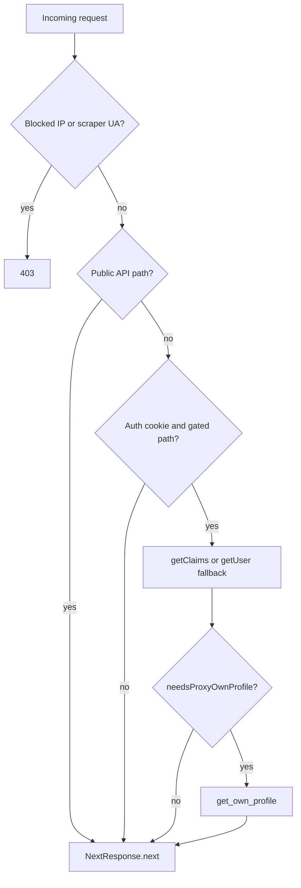

# Supabase auth traffic and JWT signing

This doc explains how our Next.js app talks to Supabase Auth, what we changed to reduce `/auth/v1/user` and `get_own_profile` volume, and how to enable asymmetric JWT signing on **self-hosted** Supabase when we are ready.

## Current state (self-hosted)

Our Supabase instance runs at `https://db.creativephotography.group` (self-hosted Docker on VPS).

As of verification with `pnpm verify:jwt`:

- `GET /auth/v1/.well-known/jwks.json` returns **HTTP 200** but **`{"keys":[]}`** (empty).
- The gateway requires the anon key on that request (401 without `apikey` / `Authorization`).
- **Asymmetric JWT signing is not enabled** — we are on legacy **HS256** (`JWT_SECRET`) only.

There is **no cloud-dashboard “Migrate JWT signing keys”** on self-hosted. That migration is done on the VPS via Supabase’s Docker tooling (see [Enable asymmetric JWTs (future)](#enable-asymmetric-jwts-future)).

## What we changed in the app

| Change | Location | Depends on JWKS? |
| --- | --- | --- |
| Skip Auth + `get_own_profile` on public pages and Link prefetches | [`src/proxy.ts`](../src/proxy.ts), [`src/utils/proxyAuth.ts`](../src/utils/proxyAuth.ts) | **No** |
| Use `getClaims()` instead of `getUser()` on gated routes | `proxy.ts`, [`getServerAuth.ts`](../src/utils/supabase/getServerAuth.ts), [`/api/views`](../src/app/api/views/route.ts), members pages | **Yes** — falls back to `getUser()` when JWKS is empty |
| Scraper IP + UA blocking | [`src/utils/requestGuard.ts`](../src/utils/requestGuard.ts), [`infra/cloudflare-waf.json`](../infra/cloudflare-waf.json) | **No** |
| Verify JWKS before deploy | [`scripts/verify-jwt-signing.mjs`](../scripts/verify-jwt-signing.mjs) (`pnpm verify:jwt`) | N/A |

### Proxy decision flow (simplified)



**Public paths** (gallery, `/@nickname/photo/…`, events, etc.) never enter the `claims` box when the visitor has no auth cookie, or when the path is not in the gated list — even if the user is logged in on public pages.

## What this means **without** asymmetric JWTs (today)

### You still get (major win)

1. **~210k/day Auth + profile calls from public traffic should drop sharply**  
   Previously, every page load and Next.js Link prefetch on gallery/photo/album pages called `getUser()` + `get_own_profile` in the proxy. That path is now skipped.

2. **Scraper load reduced**  
   Dutch scraper IP and DeviceAtlas-style UAs are blocked at origin; Cloudflare WAF rules in [`infra/cloudflare-waf.json`](../infra/cloudflare-waf.json) should be applied at the edge.

3. **Code is ready for JWT migration**  
   When JWKS is populated, `getClaims()` starts verifying locally with no app code changes.

### You do **not** get yet (until JWKS has keys)

On **gated routes** (`/account`, `/admin`, `/login`, `/members`, non-public `/api/*` with an auth cookie):

- `getClaims()` **cannot verify locally** and **falls back to `/auth/v1/user`** (same as the old `getUser()` network call).
- Each gated navigation still does **`get_own_profile`** where the proxy or layout needs profile flags (onboarding, suspension, deletion).
- `/api/views` POST (logged-in self-view check) still triggers an Auth network call via that fallback.

So: **most of the savings come from public traffic**; **logged-in account/API traffic** still hits Auth until asymmetric keys are enabled on the VPS.

### Rough expectation

| Traffic | Before | After (no JWKS) | After (JWKS enabled) |
| --- | --- | --- | --- |
| Guest on `/gallery`, photo pages, prefetches | Auth + profile every request | **None** | **None** |
| Logged-in on public pages | Auth + profile every request | **None** | **None** |
| `/account`, `/admin`, auth APIs | Auth + profile | Auth + profile (fallback) | **Local JWT verify** + profile |
| View POST while logged in | Auth + DB | Auth (fallback) + DB | **Local JWT verify** + DB |

## Verify JWT signing

From the website repo (loads `.env.local`):

```bash
pnpm verify:jwt
```

- **Success:** `OK: asymmetric JWT signing is available.` — `getClaims()` will use local JWKS.
- **Empty keys:** migrate on the VPS (below), then re-run.

## Enable asymmetric JWTs (future)

Official guide: [Self-hosted: New API Keys and Asymmetric Authentication](https://supabase.com/docs/guides/self-hosting/self-hosted-auth-keys)

On the **Supabase Docker host** (not this Next.js repo):

1. Update the self-hosted Supabase repo to a version that includes `utils/add-new-auth-keys.sh`.
2. From the directory with `docker-compose.yml`:
   ```bash
   sh utils/add-new-auth-keys.sh --update-env
   ```
3. Ensure these are wired in `docker-compose.yml` (the script can uncomment them):
   - **Auth:** `GOTRUE_JWT_KEYS: ${JWT_KEYS}`
   - **PostgREST:** `PGRST_JWT_SECRET: ${JWT_JWKS}`
   - **Realtime / Storage / Functions:** `JWT_JWKS` / `SUPABASE_JWKS`
4. Restart: `sh run.sh recreate` or `docker compose up -d --force-recreate`
5. Confirm from this repo: `pnpm verify:jwt` (non-empty keys, typically `ES256`).
6. Confirm JWKS publicly (with anon key if your gateway requires it):
   ```bash
   curl -s "https://db.creativephotography.group/auth/v1/.well-known/jwks.json" \
     -H "apikey: $NEXT_PUBLIC_SUPABASE_ANON_KEY" \
     -H "Authorization: Bearer $NEXT_PUBLIC_SUPABASE_ANON_KEY"
   ```

**Notes:**

- Legacy `ANON_KEY` / `SERVICE_ROLE_KEY` keep working during migration; the Next.js app does not have to switch to `sb_publishable_*` immediately.
- New user sessions are signed with **ES256** after `GOTRUE_JWT_KEYS` is set; existing sessions may need re-login.
- Regenerating asymmetric keys invalidates active ES256 sessions — plan a maintenance window.

## Related files

- Proxy: [`src/proxy.ts`](../src/proxy.ts)
- Route gating: [`src/utils/proxyAuth.ts`](../src/utils/proxyAuth.ts)
- Claims helper: [`src/utils/supabase/claimsUser.ts`](../src/utils/supabase/claimsUser.ts)
- Server auth: [`src/utils/supabase/getServerAuth.ts`](../src/utils/supabase/getServerAuth.ts)
- Scraper config: [`src/config/scraperUserAgents.ts`](../src/config/scraperUserAgents.ts)
- Cloudflare WAF: [`infra/cloudflare-waf.json`](../infra/cloudflare-waf.json)
